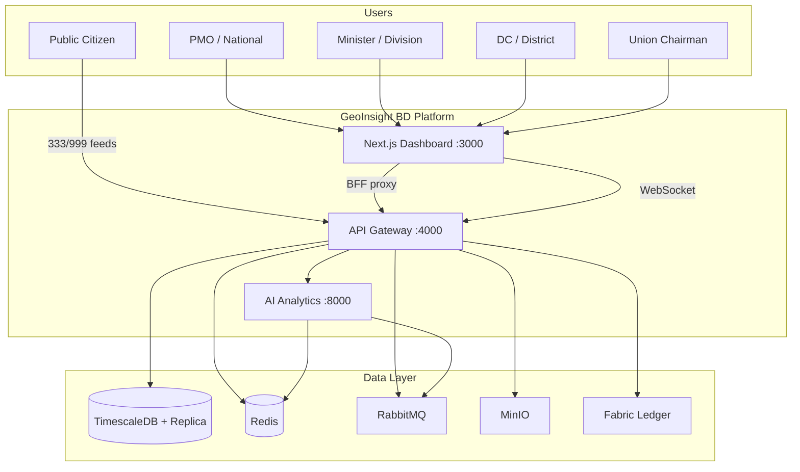
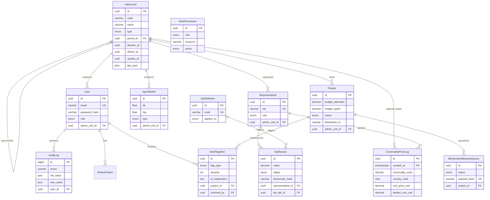
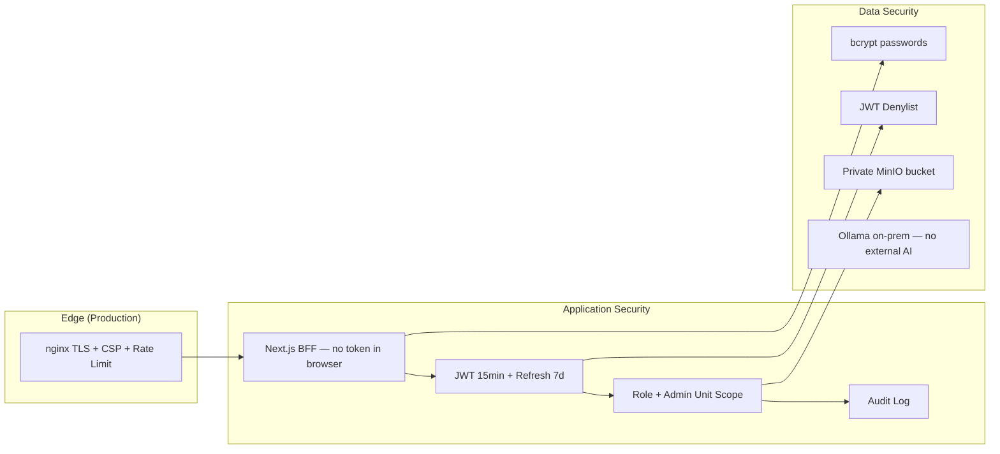

# GeoInsight BD — System Design Documentation

**GeoInsight BD** হলো বাংলাদেশের জন্য তৈরি একটি **National Governance Intelligence Platform**।  
Division → District → Upazila → Union hierarchy ধরে KPI, project tracking, red-flag alerts, agro-market data আর AI analytics এক জায়গায় আনা হয়েছে।

এই ডকুমেন্টে আছে: **HLD**, **LLD**, functional/non-functional requirements, **ERD**, tech stack rationale — সব একসাথে।

---

## Table of Contents

- [১. Project Context ও Goal](#১-project-context-ও-goal)
- [২. Functional Requirements](#২-functional-requirements)
- [৩. Non-Functional Requirements](#৩-non-functional-requirements)
- [৪. High Level Design (HLD)](#৪-high-level-design-hld)
- [৫. Low Level Design (LLD)](#৫-low-level-design-lld)
- [৬. ERD](#৬-erd-entity-relationship-diagram)
- [৭. Tech Stack — কেন কোনটা?](#৭-tech-stack--কেন-কোনটা-কোন-সমস্যা-সমাধান-করে)
- [৮. Security Architecture](#৮-security-architecture)
- [৯. Observability Architecture](#৯-observability-architecture)
- [১০. Data Flow Example](#১০-data-flow--end-to-end-example-arbitrage-heatmap)
- [১১. Monorepo Structure](#১১-monorepo-structure)
- [১২. Service Ports](#১২-service-ports-reference)
- [১৩. Architecture Decision Summary](#১৩-summary--architecture-decision-record-adr)

---

## ১. Project Context ও Goal

| বিষয় | বিবরণ |
|--------|--------|
| **Name** | GeoInsight BD |
| **Goal** | Division → District → Upazila → Union hierarchy অনুযায়ী KPI, project, alert, agro market আর AI analytics এক platform-এ দেখানো |
| **Users** | **PMO** (national), **Minister** (division), **DC** (district), **Union Chairman** |
| **Architecture style** | Monorepo microservices — ৩টা app service + shared infrastructure |

---

## ২. Functional Requirements

### ২.১ Authentication & Authorization

- Email/password দিয়ে login
- **JWT** access token (১৫ মিনিট) + refresh token (৭ দিন) — rotation সহ
- Role-based access: `PMO`, `MINISTER`, `DC`, `UNION_CHAIRMAN`
- প্রতিটি role নির্দিষ্ট `admin_unit_id` **scope**-এ সীমাবদ্ধ
- Session revoke / JWT denylist
- User registration শুধু **PMO** করতে পারে

### ২.২ Administrative Hierarchy

- Bangladesh admin structure: `DIVISION → DISTRICT → UPAZILA → UNION`
- **GeoJSON** boundary সহ admin unit management
- Hierarchy-based filtering (denormalized `division_id`, `district_id`, `upazila_id`)

### ২.৩ Representative & KPI Management

- Representative (MP, Minister, DC, Union Chairman ইত্যাদি) **CRUD**
- KPI definition ও record: `DRAFT → SUBMITTED → VERIFIED → REJECTED`
- Representative / project / admin unit / national level KPI
- Optional **Hyperledger** blockchain hash anchoring

### ২.৪ Project Tracking & Red Flags

- Project budget, status, contractor tracking
- AI-generated **red flag** alerts: budget overrun, delay, corruption risk, quality, contractor fraud
- Alert resolve workflow + **audit trail**

### ২.৫ Dashboard & Real-time

- **Choropleth map** (Bangladesh districts/divisions)
- KPI scorecards, budget variance, completion charts
- **Socket.io** দিয়ে live update: `kpi:update`, `alert:created`, dashboard refresh
- Role-scoped hierarchical rooms

### ২.৬ Agro-Economic Intelligence

- Agro market (wholesale, retail, haat, mandi) mapping
- Global commodity price time-series (**TimescaleDB** hypertable)
- **Arbitrage heatmap** — দেশভিত্তিক landed cost comparison
- Background scraping worker (৫ মিনিট interval)

### ২.৭ AI & NLP Modules (Python Service)

| Module | কাজ |
|--------|-----|
| **Sentiment** | **Bangla-BERT** দিয়ে 333/999 public feed sentiment |
| **Briefing** | **Ollama** LLM দিয়ে executive briefing |
| **Sovereign LLM** | On-prem generative AI (data sovereignty) |
| **Documents** | Document intelligence / analysis |
| **Procurement** | Procurement risk analysis |
| **Predictive** | Predictive analytics |
| **Accountability** | Accountability scoring |
| **Hazards** | Hazard / risk assessment |
| **Simulator** | Policy / budget simulator |
| **Twin** | Digital twin scenarios |
| **Citizen** | Citizen-facing chatbot |
| **Risk** | Risk scoring |

### ২.৮ Public Feeds (Unauthenticated)

- National helpline **333** ও emergency **999** feed stream
- Sovereign IP guard + strict rate limiting
- Bangla sentiment analysis overlay

### ২.৯ Blockchain (Optional)

- **Hyperledger Fabric** project milestone anchoring
- Retry queue + dead-letter handling
- Default: `FABRIC_ENABLED=false`

### ২.১০ Audit & Search

- Critical action-এর **audit log** (user, IP, old/new value)
- Cross-module search

### ২.১১ Document Storage

- **MinIO**-তে national intelligence documents (`national-intelligence-docs` bucket)

---

## ৩. Non-Functional Requirements

| Category | Requirement | Implementation |
|----------|-------------|----------------|
| **Performance** | Dashboard query < 500ms; commodity time-series fast aggregation | TimescaleDB hypertable, read replica, PgBouncer pooling, Redis cache |
| **Scalability** | Horizontal gateway scaling | Socket.io Redis adapter, stateless API, RabbitMQ async |
| **Availability** | Production 99.5%+ uptime | Docker healthchecks, retry workers, dead-letter queues |
| **Security** | JWT in HTTP-only cookies; browser-এ localStorage token নেই | Next.js **BFF** pattern, Helmet, CORS, bcrypt (12 rounds) |
| **Data Sovereignty** | Tier-4 NDC deployment — external telemetry বন্ধ | Ollama on-prem, `SOVEREIGN_MODE`, HF offline, MinIO self-hosted |
| **Rate Limiting** | Public feed-এ DDoS protection | Redis-backed rate limiter, nginx edge limits |
| **Observability** | Metrics, alerts, dashboards | Prometheus, Grafana, Alertmanager |
| **i18n** | Bangla + English UI | next-intl (`bn.json`, `en.json`) |
| **Auditability** | Immutable action trail | `audit_logs` table + optional Fabric |
| **Maintainability** | Modular monorepo | Express modules, FastAPI routers, Prisma ORM |
| **Testability** | CI pipeline tests | Jest (gateway), pytest (AI), Next.js build |

---

## ৪. High Level Design (HLD)

### ৪.১ System Context Diagram



### ৪.২ Service Responsibilities

| Service | Responsibility | কেন আলাদা রাখা হয়েছে? |
|---------|----------------|------------------------|
| **Next.js Dashboard** | UI, BFF auth, cookie management, map/charts | Frontend আলাদা রাখা; token browser-এ যায় না |
| **API Gateway** | REST, RBAC, DB, Socket.io, Fabric, MQ consumer | Single entry point + business logic orchestration |
| **AI Analytics** | ML / NLP / LLM heavy compute | Python ecosystem (PyTorch, Transformers); GPU-friendly; async worker |

### ৪.৩ Communication Patterns

```
Pattern 1: Sync HTTP (Gateway → AI)
  Dashboard → BFF → Gateway → fetch(AI_SERVICE_URL) → response

Pattern 2: Async Message Queue (RabbitMQ)
  Gateway/AI → geoinsight_exchange → gov_core_queue | ai_analytics_queue

Pattern 3: Real-time Push (Socket.io)
  RabbitMQ consumer → broadcastToHierarchy() → scoped WebSocket rooms

Pattern 4: BFF (Browser → Next.js → Gateway)
  Cookie-based auth, same-origin — CORS সহজ ও secure
```

### ৪.৪ RabbitMQ Topology

```
Exchange: geoinsight_exchange (topic, durable)

Routing Keys:
  gov.*   → gov_core_queue      (Gateway consumes)
  agro.*  → ai_analytics_queue  (AI consumes)
  ai.*    → ai_analytics_queue  (AI consumes)

Message Types (Gateway):
  kpi_update | metadata_update | dashboard_refresh | alert_created

Message Types (AI):
  arbitrage_request | sentiment_batch | risk_score_request
```

**Config:** `deploy/init/rabbitmq/definitions.json`

### ৪.৫ Deployment Views

**Local Dev (infra only):**

```bash
docker compose up -d
```

**Local Dev (full stack):**

```bash
docker compose -f docker-compose.yml -f docker-compose.apps.yml up -d --build
```

**Production:**

```bash
docker compose -f docker-compose.prod.yml pull
docker compose -f docker-compose.prod.yml up -d
```

Images: `ghcr.io/${GHCR_OWNER}/geoinsight-{api-gateway,ai-analytics,dashboard}:${IMAGE_TAG}`

---

## ৫. Low Level Design (LLD)

### ৫.১ API Gateway Module Structure

```
services/api-gateway-node/src/
├── create-app.ts          # Express app, Helmet, CORS, rate limit
├── modules/
│   ├── auth/              # login, refresh, register
│   ├── admin-unit/        # hierarchy CRUD
│   ├── kpi/               # KPI definitions + records
│   ├── project/           # projects + milestones
│   ├── alert/             # red flag alerts
│   ├── dashboard/         # aggregated dashboard data
│   ├── intelligence/      # proxy to AI (heatmap, predictive...)
│   ├── sovereign/         # sovereign LLM proxy
│   ├── blockchain/        # Fabric client + retry worker
│   ├── public-feed/       # 333/999 streams
│   └── ...
├── core/
│   ├── database/prisma.client.ts   # write + read split
│   ├── cache/redis-cache.service.ts
│   ├── auth/jwt-session.service.ts
│   └── messaging/gov-queue.consumer.ts
└── socket/socket.server.ts         # Redis adapter
```

**Registered modules:** `services/api-gateway-node/src/modules/register-modules.ts`

### ৫.২ AI Service Module Structure

```
services/ai-analytics-python/app/
├── main.py                # FastAPI lifespan, worker startup
├── api/router.py          # all module routers
├── modules/
│   ├── sentiment/         # Bangla-BERT inference
│   ├── arbitrage/         # scrape + cache + worker
│   ├── sovereign_llm/     # Ollama client
│   ├── documents/         # document intelligence
│   └── ...
├── ml/ollama_client.py    # local LLM calls
└── infrastructure/messaging/consumer.py  # RabbitMQ worker
```

### ৫.৩ Database Read/Write Split

```
DATABASE_URL        → PgBouncer geoinsight_write → Primary PostgreSQL
DATABASE_READ_URL   → PgBouncer geoinsight_read  → Read Replica
DIRECT_DATABASE_URL → Primary (Prisma migrations only)

prismaWrite  → mutations (INSERT / UPDATE / DELETE)
prismaRead   → analytics, dashboards, heavy SELECT
```

**Implementation:** `services/api-gateway-node/src/core/database/prisma.client.ts`

### ৫.৪ Auth Flow (LLD)

```
1. POST /api/auth/login (Next.js)
   → POST /api/v1/auth/login (Gateway)
   → bcrypt verify → issue accessToken + refreshToken
   → Set HTTP-only cookies: gi_access_token, gi_refresh_token

2. GET /api/proxy/kpis/definitions (Next.js)
   → Read cookie → Authorization: Bearer <token>
   → Gateway authenticate() → rbac.authorize() → Prisma query

3. Token refresh
   → POST /api/auth/refresh
   → Hash verify refresh_tokens table → rotate → new cookies

4. Logout / Revoke
   → JWT jti → Redis denylist
   → refresh_tokens.revoked_at = now()
```

**BFF routes:** `web/dashboard-nextjs/src/app/api/auth/`, `web/dashboard-nextjs/src/app/api/proxy/`

### ৫.৫ RBAC Scope Logic

```
PMO            → admin_unit_id = NULL → সব unit access
MINISTER       → DIVISION level unit
DC             → DISTRICT level unit
UNION_CHAIRMAN → UNION level unit

authorize(targetAdminUnitId):
  userScopeChain = Redis cache (admin hierarchy)
  target must be descendant of user's unit
```

**Schema:** `services/api-gateway-node/prisma/schema.prisma` — `UserRole`, `RolePermission`

### ৫.৬ Real-time Event Pipeline

```
1. KPI update in DB
2. Gateway publishes { type: "kpi_update", adminUnitId, payload }
   → geoinsight_exchange (routing: gov.kpi.update)
3. gov_core_queue consumer receives
4. broadcastToHierarchy(adminUnitId, event)
5. Socket.io rooms: unit:{id}, division:{id}, national
6. Dashboard hooks re-fetch (use-anomaly-feed, use-module-data)
```

### ৫.৭ Frontend BFF Routes

| Route | Purpose |
|-------|---------|
| `/api/auth/login` | Gateway auth |
| `/api/auth/refresh` | Token rotation |
| `/api/auth/logout` | Revoke + clear cookies |
| `/api/auth/socket-token` | WebSocket JWT |
| `/api/proxy/[...path]` | Gateway `/api/v1/*` |

---

## ৬. ERD (Entity Relationship Diagram)



### ERD Notes

- `CommodityPriceLog`: composite PK `(id, created_at)` — **TimescaleDB** hypertable (`prisma/migrations/20250627150000_timescale_commodity_perf/`)
- `AdminUnit`: self-referencing hierarchy + denormalized ancestor IDs (trigger-maintained)
- `RolePermission`: static **RBAC** matrix (role × resource × action)
- `RefreshToken`: hashed token storage, rotation support

**Source of truth:** `services/api-gateway-node/prisma/schema.prisma`

---

## ৭. Tech Stack — কেন কোনটা? কোন সমস্যা সমাধান করে?

### ৭.১ Application Layer

| Technology | কেন ব্যবহার করছি | কোন সমস্যা সমাধান করে |
|------------|------------------|------------------------|
| **Next.js 15** | React SSR/SSG, App Router, API routes | Fast dashboard, **BFF** pattern, SEO, i18n |
| **Express + TypeScript** | Mature REST ecosystem, team familiarity | Type-safe API gateway, modular routing |
| **FastAPI (Python)** | Async, auto OpenAPI, ML ecosystem | AI/ML workloads Python-এ সহজ |
| **Prisma** | Type-safe ORM, migrations | Schema versioning, read/write split support |
| **Tailwind + Radix UI** | Utility CSS + accessible components | Consistent gov-grade UI |
| **Leaflet** | Open-source maps | Bangladesh choropleth — Google Maps dependency ছাড়া |
| **Recharts** | React charts | KPI / budget visualization |
| **next-intl** | i18n | Bangla + English bilingual dashboard |

### ৭.২ Data & Storage

| Technology | কেন ব্যবহার করছি | কোন সমস্যা সমাধান করে |
|------------|------------------|------------------------|
| **PostgreSQL 16** | ACID, JSON, mature | Relational governance data integrity |
| **TimescaleDB** | PostgreSQL extension, hypertables | Commodity price time-series — lakhs of rows-এও fast query/retention |
| **PgBouncer** | Connection pooling (transaction mode) | Node.js-এর অনেক short connection → DB overload আটকানো |
| **Read Replica** | Streaming replication | Dashboard analytics primary DB-কে block করে না |
| **Redis 7** | In-memory, pub/sub, TTL | নিচে বিস্তারিত |
| **MinIO** | S3-compatible, self-hosted | Cloud S3 ছাড়াই document storage — **data sovereignty** |

### ৭.৩ Redis — কেন? (৫টি use case)

```
┌─────────────────────────────────────────────────────────┐
│  Redis Use Cases in GeoInsight BD                       │
├─────────────────────────────────────────────────────────┤
│  1. JWT Denylist / Session Revocation                   │
│     Problem: Stateless JWT logout করলেও token valid থাকে │
│     Solution: revoked jti → Redis TTL = token expiry    │
├─────────────────────────────────────────────────────────┤
│  2. Rate Limiting                                       │
│     Problem: Public 333/999 feeds DDoS target           │
│     Solution: rate-limit-redis → per-IP sliding window  │
├─────────────────────────────────────────────────────────┤
│  3. Admin Hierarchy Cache                               │
│     Problem: RBAC scope check = recursive tree walk     │
│     Solution: admin unit chain cached, O(1) lookup      │
├─────────────────────────────────────────────────────────┤
│  4. Socket.io Redis Adapter                             │
│     Problem: Multiple gateway instances = rooms split   │
│     Solution: Redis pub/sub → all instances same rooms  │
├─────────────────────────────────────────────────────────┤
│  5. Arbitrage Cache (AI service)                        │
│     Problem: Global price scrape expensive (5min cycle) │
│     Solution: TTL cache (3600s) → fast heatmap response │
└─────────────────────────────────────────────────────────┘
```

**Key files:** `jwt-session.service.ts`, `rate-limiter.middleware.ts`, `admin-scope.service.ts`, `socket.server.ts`

### ৭.৪ RabbitMQ — কেন?

```
┌─────────────────────────────────────────────────────────┐
│  RabbitMQ Use Cases                                     │
├─────────────────────────────────────────────────────────┤
│  1. Async AI Jobs                                       │
│     Problem: Sentiment / arbitrage / risk = seconds-long│
│     Solution: Queue → AI worker background-এ process করে│
├─────────────────────────────────────────────────────────┤
│  2. Service Decoupling                                  │
│     Problem: Gateway directly call AI = tight coupling  │
│     Solution: Topic exchange → routing by event type    │
├─────────────────────────────────────────────────────────┤
│  3. Real-time Fan-out                                   │
│     Problem: KPI update → many dashboard clients        │
│     Solution: gov_core_queue → Socket.io broadcast      │
├─────────────────────────────────────────────────────────┤
│  4. Durability & Retry                                  │
│     Problem: AI service down = lost jobs                │
│     Solution: Durable queues, message persistence       │
├─────────────────────────────────────────────────────────┤
│  5. Load Leveling                                       │
│     Problem: Spike in sentiment batches                 │
│     Solution: Queue buffers → worker pool (size: 4)     │
└─────────────────────────────────────────────────────────┘
```

**Redis vs RabbitMQ — পার্থক্য:**

- **Redis** = fast cache + pub/sub (ephemeral, speed)
- **RabbitMQ** = reliable message delivery + routing + persistence (durability)

### ৭.৫ AI/ML Stack

| Technology | কেন | কোন সমস্যা সমাধান করে |
|------------|-----|------------------------|
| **Bangla-BERT** (`l3cube-pune/bengali-sentiment-analysis`) | Pre-trained Bangla NLP | English models Bangla 333/999 text বুঝে না |
| **Ollama + llama3.1:8b** | Local LLM, no cloud API | **Data sovereignty** — citizen data বাইরে যায় না |
| **PyTorch + Transformers** | Industry standard ML | Model loading, inference pipeline |
| **HuggingFace offline mode** | Tier-4 air-gapped deploy | Production-এ internet ছাড়াই model serve |

### ৭.৬ Blockchain

| Technology | কেন | কোন সমস্যা সমাধান করে |
|------------|-----|------------------------|
| **Hyperledger Fabric** | Permissioned enterprise blockchain | Public chain-এ sensitive gov data যায় না; milestone immutability |

### ৭.৭ Infrastructure & Ops

| Technology | কেন | কোন সমস্যা সমাধান করে |
|------------|-----|------------------------|
| **Docker Compose** | Multi-service local + prod parity | "Works on my machine" problem eliminate করা |
| **nginx** | Reverse proxy, TLS, CSP, rate limit | Production edge security (Tier-4 NDC) |
| **Prometheus + Grafana** | Metrics collection + visualization | Gateway/AI `/metrics` endpoint monitor |
| **Alertmanager** | Alert routing | DB down, high latency notification |
| **GitHub Actions + GHCR** | CI/CD pipeline | Auto test → build → deploy VPS |
| **Locust** | Load testing | Public feed / gateway capacity verify |

### ৭.৮ Security Stack

| Technology | কেন | কোন সমস্যা সমাধান করে |
|------------|-----|------------------------|
| **HTTP-only cookies** | XSS থেকে token চুরি রোধ | localStorage vulnerable |
| **bcrypt (12 rounds)** | Password hashing | Plain text password store না করা |
| **Helmet** | Security headers | XSS, clickjacking protection |
| **Zod validation** | Runtime schema validation | Invalid input reject |
| **JWT short TTL + refresh** | Compromised token window ছোট রাখা | 15min access, 7day refresh |

---

## ৮. Security Architecture



**Tier-4 sovereignty config:** `deploy/security/tier4-sovereignty.env.example`

---

## ৯. Observability Architecture

```
Prometheus scrapes:
  - api-gateway:4000/metrics
  - ai-analytics:8000/metrics
  - postgres-exporter, redis-exporter, node-exporter, cAdvisor

Grafana dashboard: deploy/observability/grafana/dashboards/geoinsight-platform.json
Alerts: deploy/observability/prometheus/alerts/geoinsight.rules.yml
```

**Start observability stack:**

```bash
docker compose -f docker-compose.observability.yml up -d
```

---

## ১০. Data Flow — End-to-End Example (Arbitrage Heatmap)

```
1. AI Worker (every 300s) scrapes global commodity prices
2. Results → Redis cache (TTL 3600s) + TimescaleDB hypertable
3. User opens Arbitrage Heatmap on Dashboard
4. Browser → /api/proxy/intelligence/arbitrage → Gateway
5. Gateway → HTTP GET AI /api/v1/arbitrage/heatmap
6. AI reads Redis cache (hit) → returns JSON
7. Dashboard Leaflet choropleth renders landed cost overlay
```

---

## ১১. Monorepo Structure

```
geoinsight-bd/
├── docs/
│   └── SYSTEM_DESIGN.md        # এই ফাইল
├── web/dashboard-nextjs/       # Frontend + BFF
├── services/
│   ├── api-gateway-node/       # Core API + DB + Socket.io
│   └── ai-analytics-python/    # ML / NLP / LLM
├── deploy/
│   ├── init/                   # Postgres, RabbitMQ, MinIO init
│   ├── nginx/                  # Production edge
│   ├── observability/          # Prometheus, Grafana
│   ├── hyperledger/            # Fabric connection profile
│   ├── scripts/seed/           # National BD data seeds
│   └── security/               # Tier-4 sovereignty config
├── load-tests/                 # Locust scenarios
├── docker-compose.yml          # Infra
├── docker-compose.apps.yml     # Apps overlay
├── docker-compose.prod.yml     # Production
└── .github/workflows/deploy.yml
```

---

## ১২. Service Ports Reference

| Service | Port |
|---------|------|
| Dashboard | 3000 |
| API Gateway | 4000 |
| AI Analytics | 8000 |
| PostgreSQL | 5432 (55432 local) |
| PgBouncer | 6432 |
| Redis | 6379 (internal) |
| RabbitMQ | 5672 / 15672 (mgmt) |
| MinIO | 9000 / 9001 |
| Prometheus | 9090 |
| Grafana | 3002 |
| nginx | 80 / 443 |

---

## ১৩. Summary — Architecture Decision Record (ADR)

| Decision | Alternative | কেন এটা বেছে নেওয়া হয়েছে |
|----------|-------------|----------------------------|
| Monorepo microservices | Single monolith | AI compute আলাদা scale করা যায়; Python + Node best-of-breed |
| **BFF** pattern | Direct browser → Gateway | JWT security; same-origin cookies |
| **TimescaleDB** | Plain PostgreSQL | Commodity time-series performance |
| Redis + RabbitMQ | শুধু Redis | Cache vs reliable async — আলাদা দায়িত্ব |
| **Ollama** on-prem | OpenAI API | Bangladesh **data sovereignty** (Tier-4 NDC) |
| PgBouncer + Replica | Direct DB | Connection exhaustion + read scaling |
| **Socket.io** | SSE / Polling | Bi-directional real-time + room-based scope |
| Hyperledger (optional) | Public blockchain | Permissioned gov data anchoring |

---

## Related Documentation

| Document | Location |
|----------|----------|
| Setup & quick start | `README.md` |
| CI/CD, VPS deploy, Ollama approach | [`docs/DEPLOYMENT_AND_OPS.md`](./DEPLOYMENT_AND_OPS.md) |
| Ollama production setup | [`docs/OLLAMA_PRODUCTION.md`](./OLLAMA_PRODUCTION.md) |
| Environment variables | `.env.example` |
| Tier-4 sovereignty | `deploy/security/tier4-sovereignty.env.example` |
| Database schema | `services/api-gateway-node/prisma/schema.prisma` |
| RabbitMQ topology | `deploy/init/rabbitmq/definitions.json` |
| Nginx edge config | `deploy/nginx/nginx.conf` |
