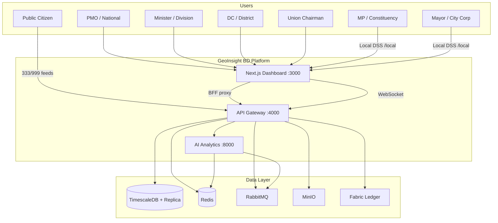
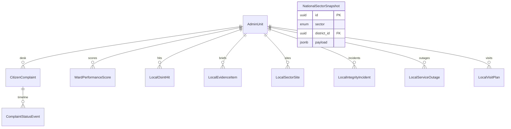
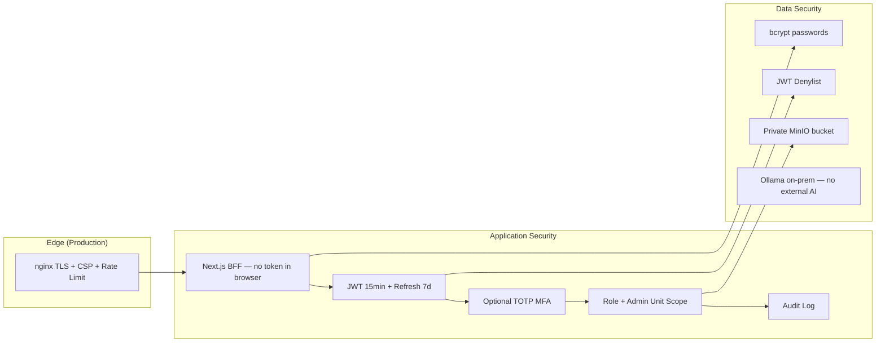

# GeoInsight BD — System Design Documentation

**GeoInsight BD** হলো বাংলাদেশের জন্য তৈরি একটি **National Governance Intelligence Platform**।  
Division → District → Upazila → Union hierarchy ধরে KPI, project tracking, red-flag alerts, agro-market data আর AI analytics এক জায়গায় আনা হয়েছে। পাশাপাশি **MP / Mayor Local Entity DSS** (ward-level) এবং **national education / health / jobs** board আছে।

এই ডকুমেন্টে আছে: **HLD**, **LLD**, functional/non-functional requirements, **ERD**, tech stack rationale — সব একসাথে।

**Related:** [Docs hub](./README.md) · [README (quick start)](../README.md) · [CI/CD & VPS](./DEPLOYMENT_AND_OPS.md) · [Ollama production](./OLLAMA_PRODUCTION.md)

---

## Table of Contents

- [১. Project Context ও Goal](#১-project-context-ও-goal)
- [২. Functional Requirements](#২-functional-requirements)
- [৩. Non-Functional Requirements](#৩-non-functional-requirements)
- [৪. High Level Design (HLD)](#৪-high-level-design-hld)
- [৫. Low Level Design (LLD)](#৫-low-level-design-lld)
- [৬. ERD](#৬-erd-entity-relationship-diagram)
- [৭. Tech Stack — কেন কোনটা?](#৭-tech-stack--কেন-কোনটা-কোন-সমস্যা-সমাধান-করে)
- [৮. Security Architecture](#৮-security-architecture)
- [৯. Observability Architecture](#৯-observability-architecture)
- [১০. Data Flow Examples](#১০-data-flow--end-to-end-examples)
- [১১. Monorepo Structure](#১১-monorepo-structure)
- [১২. Service Ports](#১২-service-ports-reference)
- [১৩. Architecture Decision Summary](#১৩-summary--architecture-decision-record-adr)
- [১৪. Cost model (indicative)](#১৪-cost-model-indicative)

---

## ১. Project Context ও Goal

| বিষয় | বিবরণ |
|--------|--------|
| **Name** | GeoInsight BD |
| **Goal** | National hierarchy (Division → Union) + Local DSS (Constituency / City Corporation → Ward) অনুযায়ী KPI, project, alert, sector, agro market আর AI analytics এক platform-এ দেখানো |
| **Users** | **PMO** (national), **Minister** (division), **DC** (district), **Union Chairman**, **MP** (constituency), **Mayor** (city corporation) |
| **Architecture style** | Monorepo microservices — ৩টা app service + shared infrastructure |

---

## ২. Functional Requirements

### ২.১ Authentication & Authorization

- Email/password দিয়ে login
- **JWT** access token (১৫ মিনিট) + refresh token (৭ দিন) — rotation সহ
- Optional **TOTP MFA** (`/auth/mfa/setup|enable|verify|disable`)
- Role-based access: `PMO`, `MINISTER`, `DC`, `UNION_CHAIRMAN`, `MP`, `MAYOR`
- প্রতিটি role নির্দিষ্ট `admin_unit_id` **scope**-এ সীমাবদ্ধ
- Session revoke / JWT denylist
- User registration শুধু **PMO** করতে পারে

### ২.২ Administrative Hierarchy

- Bangladesh admin structure: `DIVISION → DISTRICT → UPAZILA → UNION`
- Local DSS units: `CONSTITUENCY` (MP), `CITY_CORPORATION` (Mayor), `WARD`
- **GeoJSON** boundary সহ admin unit management
- Hierarchy-based filtering (denormalized `division_id`, `district_id`, `upazila_id`)

### ২.৩ Representative & KPI Management

- Representative (MP, Minister, DC, Union Chairman ইত্যাদি) **CRUD**
- KPI definition ও record: `DRAFT → SUBMITTED → VERIFIED → REJECTED`
- Representative / project / admin unit / national level KPI
- Optional **Hyperledger** blockchain hash anchoring

### ২.৪ Project Tracking & Red Flags

- Project budget, status, contractor tracking
- AI-generated **red flag** alerts: budget overrun, delay, corruption risk, quality, contractor fraud
- Alert resolve workflow + **audit trail**

### ২.৫ Dashboard & Real-time

- **Choropleth map** (Bangladesh districts/divisions)
- KPI scorecards, budget variance, completion charts
- **Socket.io** দিয়ে live update: `kpi:update`, `alert:created`, dashboard refresh
- Role-scoped hierarchical rooms

### ২.৬ Agro-Economic Intelligence

- Agro market (wholesale, retail, haat, mandi) mapping
- Global commodity price time-series (**TimescaleDB** hypertable)
- **Arbitrage heatmap** — দেশভিত্তিক landed cost comparison
- Background scraping worker (৫ মিনিট interval)

### ২.৭ AI & NLP Modules (Python Service)

| Module | কাজ |
|--------|-----|
| **Sentiment** | **Bangla-BERT** দিয়ে 333/999 public feed sentiment |
| **Briefing** | **Ollama** LLM দিয়ে executive briefing |
| **Sovereign LLM** | On-prem generative AI (data sovereignty) |
| **Documents** | Document intelligence / analysis |
| **Procurement** | Procurement risk analysis |
| **Predictive** | Predictive analytics |
| **Accountability** | Accountability scoring |
| **Hazards** | Hazard / risk assessment |
| **Simulator** | Policy / budget simulator |
| **Twin** | Digital twin scenarios |
| **Citizen** | Citizen-facing chatbot |
| **Risk** | Risk scoring |
| **Phishing** | Anti-Phishing Shield — official `.gov.bd` digital signatures + TF-IDF/Levenshtein lookalike RED_FLAG |
| **Proximity** | Interactive geo-fence (Shapely) — VIP/critical polygon INSIDE / APPROACHING alerts |
| **Face Intel** | OpenCV face match → VIP Ethical Report Card (6-month Prisma window) |
| **Narrative Shield** | Hostile narrative classify / fact-check / Ollama RAG debunk |
| **Outlook** | Strategic politics & economy outlook from news + unrest |
| **Weather** | Open-Meteo + GDACS/ReliefWeb → flood/cyclone/heat stress |
| **Ingestion** | BD RSS + Google News fetch, geo-match, Bangla sentiment |
| **Local AI** | Morning brief, complaint triage, WPI explain, photo QA, propaganda classify, citizen-assist (`/local-ai/*`) |

### ২.৮ Public Feeds (Unauthenticated)

- National helpline **333** ও emergency **999** feed stream
- Sovereign IP guard + strict rate limiting
- Bangla sentiment analysis overlay

### ২.৯ Blockchain (Optional)

- **Hyperledger Fabric** project milestone anchoring
- Retry queue + dead-letter handling
- Default: `FABRIC_ENABLED=false`

### ২.১০ Audit & Search

- Critical action-এর **audit log** (user, IP, old/new value)
- Cross-module search

### ২.১১ Document Storage

- **MinIO**-তে national intelligence documents (`national-intelligence-docs` bucket)

### ২.১২ Anti-Phishing Shield (Cyber DSS)

**Goal:** Official government web chrome clone / phishing detection for PMO analysts.

| Layer | Behavior |
|-------|----------|
| **AI** `POST /api/v1/phishing/scan` | Fetch HTML → BeautifulSoup digital signature (DOM skeleton + meta + visual tokens → SHA-256) → TF-IDF cosine + Levenshtein blend vs official gallery |
| **Policy** | `similarity ≥ threshold` **and** domain **not** on verified allow-list → `status: RED_FLAG` |
| **Seed** | Curated BD `.gov.bd` / ministry URLs (`official_domains.py`); `gov.bd` wildcard allow-list |
| **Gateway** | `POST /intelligence/phishing/scan` · `register` · `register/defaults` (JWT + RBAC) |
| **UI** | `/anti-phishing` — IntelCard + AnimatedSlider (same language as Impact Simulator) |
| **Async** | Rabbit `type: phishing_scan` → `ai.phishing`; optional Celery mockup in-module |

### ২.১৩ Interactive Proximity Alert Map (GIS DSS)

**Goal:** Real-time lat/lng against sensitive polygons (PMO, Bangabhaban, Parliament, Secretariat, HSIA, Cantonment).

| Layer | Behavior |
|-------|----------|
| **AI** | Shapely `Point` ∈ polygon / approach buffer → `INSIDE` \| `APPROACHING` \| `OUTSIDE` + distance_m |
| **Fallback** | Pure-Python ray-casting if Shapely/GEOS unavailable (dev Windows) |
| **Live feed** | `GET/POST /api/v1/proximity/live` — open-track / ADS-B-style demo VIP orbits (replaceable with public GPS APIs) |
| **Gateway** | `/intelligence/proximity/live` · `/check` · `/zones` |
| **UI** | Command search panel (no sidebar route) — Leaflet polygons + track markers; map click = analyst pin |

### ২.১৪ Face Intel — VIP Ethical Report Card (CV + DSS)

**Goal:** Face detect/match from camera or upload → join Representative profile → last **6 months** ethical dossier.

| Layer | Behavior |
|-------|----------|
| **AI** | OpenCV Haar detect + compact embedding gallery (no dlib); `POST /api/v1/face-intel/match` |
| **Gateway** | `POST /intelligence/face-intel/identify` — match then Prisma aggregation |
| **Ethical card** | `{ vip_name, designation, ethical_score (0–100), red_flags_count, key_allegations[] }` |
| **Data (6 mo)** | `RedFlagAlert` / budget overrun projects (same `adminUnitId`), `KpiRecord` GRIEVANCE/COMPLETION, `LiveSignal`, `ExternalArticle` grievance proxies |
| **UI** | `/face-intel` — webcam/upload + VIP gallery; **Real-time Alert Overlay Card** |

**Split rationale:** CV in Python; SQL windowing + RBAC in Node (same pattern as Accountability).

### ২.১৫ Narrative Shield (Counter-Disinfo DSS)

**Goal:** Detect, classify, fact-check, and debunk hostile narratives from open news sources.

| Layer | Behavior |
|-------|----------|
| **AI** | Keyword category scoring; SHA-256 fingerprint dedup; trust allow/block lists; Google verify + optional Serper/CSE; Ollama RAG debunk (rule templates fallback); threat bands `0.30 / 0.55 / 0.80` |
| **Gateway** | `/narrative-shield/feed`, `/stats`, `/refresh`, `/debunk`, `/escalate`, `/dismiss`, `/bulk`, `/dedup`, `/export`, `/reset` |
| **Store** | Prisma `NarrativeSignal`, `NarrativeAuditLog` |
| **UI** | `/narrative-shield` |
| **RBAC** | Read/act: PMO, MINISTER, DC · Ops (refresh/bulk/export): PMO, MINISTER · Reset: PMO |

### ২.১৬ Unrest Pulse

**Goal:** Protest / public-unrest signal from ingested news — district scores + movement clusters.

| Layer | Behavior |
|-------|----------|
| **Gateway-only** | BN/EN keyword categories; sports-noise filter; BD relevance gate; `unrest_score`; `clusterProtestMovements`; Redis cache |
| **Snapshot** | `IntelAnalysisSnapshot` kind `UNREST` |
| **Routes** | `GET /unrest/pulse`, `POST /unrest/refresh` |
| **UI** | `/unrest` |

### ২.১৭ Strategic Outlook

**Goal:** Politics / economy thematic outlook + scenarios for PMO briefing.

| Layer | Behavior |
|-------|----------|
| **AI** | `POST /outlook/generate` — Ollama structured output (challenges / direction / scenarios) with fallback |
| **Gateway** | `GET /outlook/strategic`, `POST /outlook/refresh` — news themes + unrest summary → AI |
| **Snapshot** | kind `OUTLOOK` |
| **UI** | `/outlook` |

### ২.১৮ Divisional Crisis Pulse

**Goal:** Division-level composite risk (not official crime telemetry).

| Layer | Behavior |
|-------|----------|
| **Gateway** | `GET /divisional-crisis/pulse` — 48h window: weather stress + alert severity + grievance articles |
| **Sources** | `live_signals`, `external_articles`, `open_meteo` |
| **UI** | `/divisional-crisis` (sidebar minTier 4 — all roles) |

### ২.১৯ Weather & Hazards Feed

| Layer | Behavior |
|-------|----------|
| **AI** | `GET /weather/fetch` — Open-Meteo, GDACS, ReliefWeb; heat-index; monsoon-aware risk 1–5 |
| **Gateway** | `GET /weather/live` |
| **Store** | `WeatherObservation`, `DisasterAlert` |
| **UI** | Embedded in `/hazards` (no dedicated weather page) |

### ২.২০ Ingestion, Pipeline & Intel Store

| Module | Role |
|--------|------|
| **Ingestion** | AI fetch RSS/Google News → geo-match → Bangla-BERT → Gateway upsert `ExternalArticle` |
| **Pipeline** | Interval workers + `POST /pipeline/sync/:job` for news, weather, unrest, narrative, outlook, briefing, commodities, … |
| **Intel** | Read APIs for `IntelAnalysisSnapshot`, `PipelineJobRun`, `IngestionSyncRun` |

### ২.২১ Local Entity DSS (MP / Mayor)

Ward-level command surface — PMO oversight (`?entityId=`) + MP/Mayor desks. Catalog: **CTG-8, CTG-9, CTG-10, CCC, COCC** (`local-entity.catalog.ts`). Roles: `PMO`, `MP`, `MAYOR`. Gateway: `local-entity`. AI: `local_ai`.

| Capability | Path / API | Notes |
|------------|------------|-------|
| Overview + morning brief | `/local` · `/local-entity/overview`, `/morning-brief` | CSV export + WhatsApp digest; PMO `scope=all` |
| Field queue | `/local/field` · `/field-summary` | Phone-first overdue / unassigned |
| Complaints SLA | `/local/complaints` | 24h Instant Action; triage (fast LLM); assign; before/after photo QA |
| WPI / heatmap / scorecard | `/local/wpi`, `/heatmap`, `/scorecard` | Ward scores + Ollama explain; heatmap aggregates layers (no `MapLayer` table) |
| Budget / visits | `/local/budget`, `/visits` | Entity ADP + AI visit recommend |
| OSINT / pulse / unrest | `/local/osint`, `/pulse` · `/local-entity/unrest` | Keywords, propaganda flag; unrest embedded in pulse |
| Evidence | `/local/evidence` | Thesis / expert / policy abstracts (`LocalEvidenceItem`) |
| Sectors | `/local/education`, `/health`, `/jobs` · `/local-entity/sector` | School / clinic / employment site pins |
| Integrity | `/local/crime`, `/corruption` · `/local-entity/integrity` | Crime + corruption desks (`LocalIntegrityIncident`) |
| Command room | `/local/command` | Multi-layer overlay + what-if (not persisted) |
| Specialty / outages / alerts | `/local/specialty`, `/outage`, `/alerts` | Role packs, service outages, WhatsApp/voice retry |
| MFA | `/local/security` | Same TOTP as national auth |
| National board | `/local-entity/national-board` | PMO / MINISTER cross-entity scoreboard |

### ২.২২ National Sectors (Education · Health · Jobs)

**Goal:** District-level EDUCATION / HEALTH / EMPLOYMENT snapshots for PMO and Ministers — not the local ward desk.

| Layer | Behavior |
|-------|----------|
| **Store** | Prisma `NationalSectorSnapshot` (64 districts) |
| **Gateway** | `GET /national-sector/board` — PMO, MINISTER |
| **UI** | `/sectors` + home `pmo-national-sector-strip` |
| **Seed** | `deploy/scripts/seed/24-national-sectors.sql` |

---

## ৩. Non-Functional Requirements

| Category | Requirement | Implementation |
|----------|-------------|----------------|
| **Performance** | Dashboard query < 500ms; commodity time-series fast aggregation | TimescaleDB hypertable, read replica, PgBouncer pooling, Redis cache |
| **Scalability** | Horizontal gateway scaling | Socket.io Redis adapter, stateless API, RabbitMQ async |
| **Availability** | Production 99.5%+ uptime | Docker healthchecks, retry workers, dead-letter queues |
| **Security** | JWT in HTTP-only cookies; optional TOTP MFA; browser-এ localStorage token নেই | Next.js **BFF** pattern, Helmet, CORS, bcrypt (12 rounds), `/auth/mfa/*` |
| **Data Sovereignty** | Tier-4 NDC deployment — external telemetry বন্ধ | Ollama on-prem, `SOVEREIGN_MODE`, HF offline, MinIO self-hosted |
| **Rate Limiting** | Public feed-এ DDoS protection | Redis-backed rate limiter, nginx edge limits |
| **Observability** | Metrics, alerts, dashboards | Prometheus, Grafana, Alertmanager |
| **i18n** | Bangla + English UI | next-intl (`bn.json`, `en.json`) |
| **Auditability** | Immutable action trail | `audit_logs` table + optional Fabric |
| **Maintainability** | Modular monorepo | Express modules, FastAPI routers, Prisma ORM |
| **Testability** | CI pipeline tests | Jest (gateway), pytest (AI), Next.js build |

---

## ৪. High Level Design (HLD)

### ৪.১ System Context Diagram



### ৪.২ Service Responsibilities

| Service | Responsibility | কেন আলাদা রাখা হয়েছে? |
|---------|----------------|------------------------|
| **Next.js Dashboard** | UI, BFF auth, cookie management, map/charts | Frontend আলাদা রাখা; token browser-এ যায় না |
| **API Gateway** | REST, RBAC, DB, Socket.io, Fabric, MQ consumer | Single entry point + business logic orchestration |
| **AI Analytics** | ML / NLP / LLM / CV / geo-fence / phishing fingerprints | Python ecosystem (PyTorch, OpenCV, Shapely); GPU-friendly; async worker |

### ৪.৩ Communication Patterns

```
Pattern 1: Sync HTTP (Gateway → AI)
  Dashboard → BFF → Gateway → fetch(AI_SERVICE_URL) → response

Pattern 2: Async Message Queue (RabbitMQ)
  Gateway/AI → geoinsight_exchange → gov_core_queue | ai_analytics_queue

Pattern 3: Real-time Push (Socket.io)
  RabbitMQ consumer → broadcastToHierarchy() → scoped WebSocket rooms

Pattern 4: BFF (Browser → Next.js → Gateway)
  Cookie-based auth, same-origin — CORS সহজ ও secure
```

### ৪.৪ RabbitMQ Topology

```
Exchange: geoinsight_exchange (topic, durable)

Routing Keys:
  gov.*   → gov_core_queue      (Gateway consumes)
  agro.*  → ai_analytics_queue  (AI consumes)
  ai.*    → ai_analytics_queue  (AI consumes)

Message Types (Gateway):
  kpi_update | metadata_update | dashboard_refresh | alert_created

Message Types (AI):
  arbitrage_request | sentiment_batch | risk_score_request | phishing_scan
```

**Config:** `deploy/init/rabbitmq/definitions.json`

Routing results (examples): `ai.risk`, `ai.sentiment`, `ai.phishing`, `gov.arbitrage`.

### ৪.৫ Deployment Views

**Local Dev (infra only):**

```bash
docker compose up -d
```

**Local Dev (full stack):**

```bash
docker compose -f docker-compose.yml -f docker-compose.apps.yml up -d --build
```

**Production:**

```bash
docker compose -f docker-compose.prod.yml pull
docker compose -f docker-compose.prod.yml up -d
```

Images: `ghcr.io/${GHCR_OWNER}/geoinsight-{api-gateway,ai-analytics,dashboard}:${IMAGE_TAG}`

---

## ৫. Low Level Design (LLD)

### ৫.১ API Gateway Module Structure

```
services/api-gateway-node/src/
├── create-app.ts          # Express app, Helmet, CORS, rate limit
├── modules/
│   ├── auth/              # login, refresh, register
│   ├── admin-unit/        # hierarchy CRUD
│   ├── kpi/               # KPI definitions + records
│   ├── project/           # projects + milestones
│   ├── alert/             # red flag alerts
│   ├── dashboard/         # aggregated dashboard data
│   ├── briefing/          # morning briefing proxy
│   ├── intelligence/      # proxy to AI (heatmap, predictive, phishing…)
│   ├── narrative-shield/  # counter-disinfo ops + AI classify/debunk
│   ├── unrest/            # protest pulse from ExternalArticle
│   ├── outlook/           # strategic outlook + AI generate
│   ├── divisional-crisis/ # division risk composite
│   ├── weather/           # live weather / disaster alerts
│   ├── ingestion/         # news sync + article queries
│   ├── pipeline/          # cron + manual sync jobs
│   ├── intel/             # snapshot & run history APIs
│   ├── national-sector/   # education / health / jobs board
│   ├── local-entity/      # MP/Mayor DSS (complaints, WPI, sectors, integrity…)
│   ├── sovereign/         # sovereign LLM proxy
│   ├── blockchain/        # Fabric client + retry worker
│   ├── public-feed/       # 333/999 streams
│   └── ...
├── core/
│   ├── database/prisma.client.ts   # write + read split
│   ├── cache/redis-cache.service.ts
│   ├── auth/jwt-session.service.ts
│   └── messaging/gov-queue.consumer.ts
└── socket/socket.server.ts         # Redis adapter
```

**Registered modules:** `services/api-gateway-node/src/modules/register-modules.ts`

### ৫.২ AI Service Module Structure

```
services/ai-analytics-python/app/
├── main.py                # FastAPI lifespan, worker startup
├── api/router.py          # all module routers
├── modules/
│   ├── sentiment/         # Bangla-BERT inference
│   ├── arbitrage/         # scrape + cache + worker
│   ├── sovereign_llm/     # Ollama client
│   ├── narrative_shield/  # classify, fact-check, RAG debunk
│   ├── outlook/           # strategic outlook generation
│   ├── weather/           # Open-Meteo + disaster feeds
│   ├── ingestion/         # RSS / Google News fetch + geo-match
│   ├── documents/         # document intelligence
│   ├── accountability/    # peer KPI / alert formula scores
│   ├── hazards/           # hazard overlay scoring
│   ├── phishing/          # Anti-Phishing Shield
│   ├── proximity/         # Shapely geo-fence + live VIP tracks
│   ├── face_intel/        # OpenCV face match + VIP gallery
│   ├── local_ai/          # local DSS briefs, triage, WPI, photo QA
│   └── ...
├── ml/ollama_client.py    # local LLM calls
└── infrastructure/messaging/consumer.py  # RabbitMQ worker
```

**Primary dashboard routes:** `/`, `/briefing`, `/narrative-shield`, `/outlook`, `/unrest`, `/sectors`, `/divisional-crisis`, `/anti-phishing`, `/hazards`, `/agro`, `/procurement`, `/kpis`, `/projects`, `/alerts`, `/documents`, `/audit-trail`, `/notifications`, `/representatives`, `/face-intel`, `/local/*`  
**Gateway proxies (examples):** `intelligence/*`, `narrative-shield/*`, `outlook/*`, `unrest/*`, `national-sector/*`, `local-entity/*`, `weather/*`, `ingestion/*`, `pipeline/*`

### ৫.৩ Database Read/Write Split

```
DATABASE_URL        → PgBouncer geoinsight_write → Primary PostgreSQL
DATABASE_READ_URL   → PgBouncer geoinsight_read  → Read Replica
DIRECT_DATABASE_URL → Primary (Prisma migrations only)

prismaWrite  → mutations (INSERT / UPDATE / DELETE)
prismaRead   → analytics, dashboards, heavy SELECT
```

**Implementation:** `services/api-gateway-node/src/core/database/prisma.client.ts`

### ৫.৪ Auth Flow (LLD)

```
1. POST /api/auth/login (Next.js)
   → POST /api/v1/auth/login (Gateway)
   → bcrypt verify
   → if User.mfaSecret set: return { requiresMfa, mfaToken } (no cookies yet)
   → else issue accessToken + refreshToken → HTTP-only cookies

1b. POST /api/auth/mfa/verify (when MFA on)
   → TOTP (RFC 6238) → then cookies as above

2. GET /api/proxy/kpis/definitions (Next.js)
   → Read cookie → Authorization: Bearer <token>
   → Gateway authenticate() → rbac.authorize() → Prisma query

3. Token refresh
   → POST /api/auth/refresh
   → Hash verify refresh_tokens table → rotate → new cookies

4. Logout / Revoke
   → JWT jti → Redis denylist
   → refresh_tokens.revoked_at = now()

5. MFA lifecycle (authenticated): /auth/mfa/setup | enable | disable
```

**BFF routes:** `web/dashboard-nextjs/src/app/api/auth/`, `web/dashboard-nextjs/src/app/api/proxy/`

### ৫.৫ RBAC Scope Logic

```
PMO            → admin_unit_id = NULL → সব unit access
MINISTER       → DIVISION level unit
DC             → DISTRICT level unit
UNION_CHAIRMAN → UNION level unit
MP             → CONSTITUENCY → Local DSS `/local` (wards under seat)
MAYOR          → CITY_CORPORATION → Local DSS `/local`
PMO            → `/local?entityId=` oversight of catalog seats

authorize(targetAdminUnitId):
  userScopeChain = Redis cache (admin hierarchy)
  target must be descendant of user's unit
```

**Schema:** `services/api-gateway-node/prisma/schema.prisma` — `UserRole`, `RolePermission`

### ৫.৬ Real-time Event Pipeline

```
1. KPI update in DB
2. Gateway publishes { type: "kpi_update", adminUnitId, payload }
   → geoinsight_exchange (routing: gov.kpi.update)
3. gov_core_queue consumer receives
4. broadcastToHierarchy(adminUnitId, event)
5. Socket.io rooms: unit:{id}, division:{id}, national
6. Dashboard hooks re-fetch (use-anomaly-feed, use-module-data)
```

### ৫.৭ Frontend BFF Routes

| Route | Purpose |
|-------|---------|
| `/api/auth/login` | Gateway auth (may return MFA challenge) |
| `/api/auth/mfa/verify` | Complete login with TOTP |
| `/api/auth/refresh` | Token rotation |
| `/api/auth/logout` | Revoke + clear cookies |
| `/api/auth/socket-token` | WebSocket JWT |
| `/api/proxy/[...path]` | Gateway `/api/v1/*` |

---

## ৬. ERD (Entity Relationship Diagram)

```mermaid
erDiagram
    AdminUnit ||--o{ AdminUnit : "parent-child"
    AdminUnit ||--o{ User : "scoped to"
    AdminUnit ||--o{ Representative : "represents"
    AdminUnit ||--o{ Project : "hosts"
    AdminUnit ||--o{ AgroMarket : "located in"
    AdminUnit ||--o{ CommodityPriceLog : "optional context"

    User ||--o{ AuditLog : "performs"
    User ||--o{ RefreshToken : "has"
    User ||--o{ RedFlagAlert : "resolves"

    Representative ||--o{ KpiRecord : "measured by"
    Representative ||--o{ CommodityPriceLog : "optional"

    KpiDefinition ||--o{ KpiRecord : "defines"

    Project ||--o{ RedFlagAlert : "triggers"
    Project ||--o{ BlockchainMilestoneQueue : "queued for"

    AdminUnit {
        uuid id PK
        varchar code
        varchar name
        enum type
        uuid parent_id FK
        uuid division_id
        uuid district_id
        uuid upazila_id
        json geo_json
    }

    User {
        uuid id PK
        varchar email UK
        varchar password_hash
        enum role
        uuid admin_unit_id FK
    }

    Representative {
        uuid id PK
        varchar nid UK
        enum role
        uuid admin_unit_id FK
    }

    KpiDefinition {
        uuid id PK
        varchar code UK
        enum applies_to
    }

    KpiRecord {
        uuid id PK
        decimal value
        enum status
        varchar blockchain_hash
        uuid representative_id FK
        uuid kpi_def_id FK
    }

    Project {
        uuid id PK
        decimal budget_allocated
        decimal budget_spent
        enum status
        varchar blockchain_tx
        uuid admin_unit_id FK
    }

    RedFlagAlert {
        uuid id PK
        enum flag_type
        int severity
        text ai_explanation
        uuid project_id FK
        uuid resolved_by FK
    }

    CommodityPriceLog {
        uuid id PK
        timestamptz created_at PK
        varchar commodity_code
        char country_code
        decimal unit_price_usd
        decimal landed_cost_usd
    }

    AgroMarket {
        uuid id PK
        float lat
        float lng
        enum type
        uuid admin_unit_id FK
    }

    AuditLog {
        bigint id PK
        varchar action
        json old_value
        json new_value
        uuid user_id FK
    }

    BlockchainMilestoneQueue {
        uuid id PK
        enum status
        varchar payload_hash UK
        uuid project_id FK
    }

    RolePermission {
        uuid id PK
        enum role
        varchar resource
        enum action
    }

    ExternalArticle ||--o{ NarrativeSignal : "may seed"
    User ||--o{ NarrativeAuditLog : "acts on"
    NarrativeSignal ||--o{ NarrativeAuditLog : "audited"

    ExternalArticle {
        uuid id PK
        varchar url UK
        text title
        text body
        varchar district_code
        float sentiment_score
        timestamptz published_at
    }

    NarrativeSignal {
        uuid id PK
        enum threat_level
        enum category
        enum status
        enum fact_check_status
        varchar fingerprint
    }

    WeatherObservation {
        uuid id PK
        varchar location_key
        float temp_c
        int flood_risk
        int cyclone_risk
        int heat_risk
    }

    DisasterAlert {
        uuid id PK
        varchar source
        varchar event_type
        int severity
        jsonb geo
    }

    IntelAnalysisSnapshot {
        uuid id PK
        enum kind
        jsonb payload
        timestamptz created_at
    }

    PipelineJobRun {
        uuid id PK
        varchar job
        enum status
        timestamptz started_at
    }

    IngestionSyncRun {
        uuid id PK
        int articles_upserted
        enum status
    }
```



### ERD Notes

- `CommodityPriceLog`: composite PK `(id, created_at)` — **TimescaleDB** hypertable (`prisma/migrations/20250627150000_timescale_commodity_perf/`)
- `AdminUnit`: self-referencing hierarchy + denormalized ancestor IDs (trigger-maintained)
- `RolePermission`: static **RBAC** matrix (role × resource × action)
- `RefreshToken`: hashed token storage, rotation support
- Intel / narrative / weather models support pipeline-driven DSS (unrest, outlook, narrative-shield, hazards)
- `User.mfaSecret` — optional TOTP
- Local DSS models (below) sit on `AdminUnit` (`CONSTITUENCY` / `CITY_CORPORATION` / `WARD`)
- Map “layers” are **computed** in `/local-entity/heatmap` — no `MapLayer` table



**Source of truth:** `services/api-gateway-node/prisma/schema.prisma`

---

## ৭. Tech Stack — কেন কোনটা? কোন সমস্যা সমাধান করে?

### ৭.১ Application Layer

| Technology | কেন ব্যবহার করছি | কোন সমস্যা সমাধান করে |
|------------|------------------|------------------------|
| **Next.js 15** | React SSR/SSG, App Router, API routes | Fast dashboard, **BFF** pattern, SEO, i18n |
| **Express + TypeScript** | Mature REST ecosystem, team familiarity | Type-safe API gateway, modular routing |
| **FastAPI (Python)** | Async, auto OpenAPI, ML ecosystem | AI/ML workloads Python-এ সহজ |
| **Prisma** | Type-safe ORM, migrations | Schema versioning, read/write split support |
| **Tailwind + Radix UI** | Utility CSS + accessible components | Consistent gov-grade UI |
| **Leaflet** | Open-source maps | Bangladesh choropleth — Google Maps dependency ছাড়া |
| **Recharts** | React charts | KPI / budget visualization |
| **next-intl** | i18n | Bangla + English bilingual dashboard |

### ৭.২ Data & Storage

| Technology | কেন ব্যবহার করছি | কোন সমস্যা সমাধান করে |
|------------|------------------|------------------------|
| **PostgreSQL 16** | ACID, JSON, mature | Relational governance data integrity |
| **TimescaleDB** | PostgreSQL extension, hypertables | Commodity price time-series — lakhs of rows-এও fast query/retention |
| **PgBouncer** | Connection pooling (transaction mode) | Node.js-এর অনেক short connection → DB overload আটকানো |
| **Read Replica** | Streaming replication | Dashboard analytics primary DB-কে block করে না |
| **Redis 7** | In-memory, pub/sub, TTL | নিচে বিস্তারিত |
| **MinIO** | S3-compatible, self-hosted | Cloud S3 ছাড়াই document storage — **data sovereignty** |

### ৭.৩ Redis — কেন? (৫টি use case)

```
┌─────────────────────────────────────────────────────────┐
│  Redis Use Cases in GeoInsight BD                       │
├─────────────────────────────────────────────────────────┤
│  1. JWT Denylist / Session Revocation                   │
│     Problem: Stateless JWT logout করলেও token valid থাকে │
│     Solution: revoked jti → Redis TTL = token expiry    │
├─────────────────────────────────────────────────────────┤
│  2. Rate Limiting                                       │
│     Problem: Public 333/999 feeds DDoS target           │
│     Solution: rate-limit-redis → per-IP sliding window  │
├─────────────────────────────────────────────────────────┤
│  3. Admin Hierarchy Cache                               │
│     Problem: RBAC scope check = recursive tree walk     │
│     Solution: admin unit chain cached, O(1) lookup      │
├─────────────────────────────────────────────────────────┤
│  4. Socket.io Redis Adapter                             │
│     Problem: Multiple gateway instances = rooms split   │
│     Solution: Redis pub/sub → all instances same rooms  │
├─────────────────────────────────────────────────────────┤
│  5. Arbitrage Cache (AI service)                        │
│     Problem: Global price scrape expensive (5min cycle) │
│     Solution: TTL cache (3600s) → fast heatmap response │
└─────────────────────────────────────────────────────────┘
```

**Key files:** `jwt-session.service.ts`, `rate-limiter.middleware.ts`, `admin-scope.service.ts`, `socket.server.ts`

### ৭.৪ RabbitMQ — কেন?

```
┌─────────────────────────────────────────────────────────┐
│  RabbitMQ Use Cases                                     │
├─────────────────────────────────────────────────────────┤
│  1. Async AI Jobs                                       │
│     Problem: Sentiment / arbitrage / risk = seconds-long│
│     Solution: Queue → AI worker background-এ process করে│
├─────────────────────────────────────────────────────────┤
│  2. Service Decoupling                                  │
│     Problem: Gateway directly call AI = tight coupling  │
│     Solution: Topic exchange → routing by event type    │
├─────────────────────────────────────────────────────────┤
│  3. Real-time Fan-out                                   │
│     Problem: KPI update → many dashboard clients        │
│     Solution: gov_core_queue → Socket.io broadcast      │
├─────────────────────────────────────────────────────────┤
│  4. Durability & Retry                                  │
│     Problem: AI service down = lost jobs                │
│     Solution: Durable queues, message persistence       │
├─────────────────────────────────────────────────────────┤
│  5. Load Leveling                                       │
│     Problem: Spike in sentiment batches                 │
│     Solution: Queue buffers → worker pool (size: 4)     │
└─────────────────────────────────────────────────────────┘
```

**Redis vs RabbitMQ — পার্থক্য:**

- **Redis** = fast cache + pub/sub (ephemeral, speed)
- **RabbitMQ** = reliable message delivery + routing + persistence (durability)

### ৭.৫ AI/ML Stack

| Technology | কেন | কোন সমস্যা সমাধান করে |
|------------|-----|------------------------|
| **Bangla-BERT** (`l3cube-pune/bengali-sentiment-analysis`) | Pre-trained Bangla NLP | English models Bangla 333/999 text বুঝে না |
| **Ollama + gpt-oss:20b** | Local LLM, no cloud API | **Data sovereignty** — citizen data বাইরে যায় না |
| **PyTorch + Transformers** | Industry standard ML | Model loading, inference pipeline |
| **HuggingFace offline mode** | Tier-4 air-gapped deploy | Production-এ internet ছাড়াই model serve |

### ৭.৬ Blockchain

| Technology | কেন | কোন সমস্যা সমাধান করে |
|------------|-----|------------------------|
| **Hyperledger Fabric** | Permissioned enterprise blockchain | Public chain-এ sensitive gov data যায় না; milestone immutability |

### ৭.৭ Infrastructure & Ops

| Technology | কেন | কোন সমস্যা সমাধান করে |
|------------|-----|------------------------|
| **Docker Compose** | Multi-service local + prod parity | "Works on my machine" problem eliminate করা |
| **nginx** | Reverse proxy, TLS, CSP, rate limit | Production edge security (Tier-4 NDC) |
| **Prometheus + Grafana** | Metrics collection + visualization | Gateway/AI `/metrics` endpoint monitor |
| **Alertmanager** | Alert routing | DB down, high latency notification |
| **GitHub Actions + GHCR** | CI/CD pipeline | Auto test → build → deploy VPS |
| **Locust** | Load testing | Public feed / gateway capacity verify |

### ৭.৮ Security Stack

| Technology | কেন | কোন সমস্যা সমাধান করে |
|------------|-----|------------------------|
| **HTTP-only cookies** | XSS থেকে token চুরি রোধ | localStorage vulnerable |
| **bcrypt (12 rounds)** | Password hashing | Plain text password store না করা |
| **Helmet** | Security headers | XSS, clickjacking protection |
| **Zod validation** | Runtime schema validation | Invalid input reject |
| **JWT short TTL + refresh** | Compromised token window ছোট রাখা | 15min access, 7day refresh |

---

## ৮. Security Architecture



**Tier-4 sovereignty config:** `deploy/security/tier4-sovereignty.env.example`

---

## ৯. Observability Architecture

```
Prometheus scrapes:
  - api-gateway:4000/metrics
  - ai-analytics:8000/metrics
  - postgres-exporter, redis-exporter, node-exporter, cAdvisor

Grafana dashboard: deploy/observability/grafana/dashboards/geoinsight-platform.json
Alerts: deploy/observability/prometheus/alerts/geoinsight.rules.yml
```

**Start observability stack:**

```bash
docker compose -f docker-compose.observability.yml up -d
```

---

## ১০. Data Flow — End-to-End Examples

### ১০.১ Arbitrage Heatmap

```
1. AI Worker (every 300s) scrapes global commodity prices
2. Results → Redis cache (TTL 3600s) + TimescaleDB hypertable
3. User opens Arbitrage Heatmap on Dashboard
4. Browser → /api/proxy/intelligence/arbitrage → Gateway
5. Gateway → HTTP GET AI /api/v1/arbitrage/heatmap
6. AI reads Redis cache (hit) → returns JSON
7. Dashboard Leaflet choropleth renders landed cost overlay
```

### ১০.২ Anti-Phishing RED_FLAG

```
1. Analyst pastes suspicious URL on /anti-phishing
2. BFF → Gateway POST /intelligence/phishing/scan
3. AI fetches HTML (timeout-safe) → digital signature
4. Compare vs official gallery (cosine + Levenshtein)
5. Domain not verified + score ≥ 0.90 → { status: RED_FLAG, similarity_score, domain_details }
6. Optional: publish ai.phishing for ops fans-out
```

### ১০.৩ Proximity geo-fence alert

```
1. Dashboard polls GET /intelligence/proximity/live (~4s)
2. AI synthesizes / ingests lat,lng tracks + evaluates Shapely polygons
3. Track INSIDE PMO / APPROACHING buffer → alert payload
4. Leaflet draws fence polygons + severity-colored markers
5. Analyst map-click → POST /proximity/check for manual pin
```

### ১০.৪ Face Intel Ethical Report Card

```
1. Webcam frame / upload / VIP gallery click on /face-intel
2. Gateway POST /intelligence/face-intel/identify
3. AI OpenCV match → vip_id / nid / representative_id
4. Gateway Prisma (6 months): red flags, overruns, KPI grievance, news grievance
5. Response { vip_name, designation, ethical_score, red_flags_count, key_allegations[] }
6. UI renders Real-time Alert Overlay Card
```

### ১০.৫ Narrative Shield debunk

```
1. Pipeline / refresh ingests open news → AI classify → NarrativeSignal rows
2. Analyst opens /narrative-shield feed (threat-sorted)
3. POST /narrative-shield/debunk → AI fact-check + Ollama RAG (or template)
4. Escalate / dismiss → NarrativeAuditLog; optional export CSV
```

### ১০.৬ Unrest → Outlook → Briefing chain

```
1. Ingestion sync upserts ExternalArticle (+ sentiment, geo)
2. Unrest pulse scores districts / clusters movements → snapshot UNREST
3. Outlook generate uses news themes + unrest summary → snapshot OUTLOOK
4. Morning briefing can consume recent intel snapshots + KPI / alert context
```

### ১০.৭ Local complaint (24h SLA)

```
1. MP/Mayor (or PMO with entityId) POST /local-entity/complaints
2. Optional POST /complaints/triage → AI local_ai/complaint-triage (fast model)
3. Assign / start / notes → ComplaintStatusEvent timeline
4. Resolve with before/after photos → AI photo-qa
5. OVERDUE + WPI recompute; heatmap aggregates pins; morning-brief includes SLA
```

---

## ১১. Monorepo Structure

```
geoinsight-bd/
├── docs/
│   ├── README.md               # Docs hub
│   ├── SYSTEM_DESIGN.md        # এই ফাইল
│   ├── DEPLOYMENT_AND_OPS.md   # CI/CD + VPS
│   └── OLLAMA_PRODUCTION.md
├── web/dashboard-nextjs/       # Frontend + BFF
│   ├── README.md
│   └── src/app/(dashboard)/
│       ├── narrative-shield/
│       ├── outlook/
│       ├── unrest/
│       ├── divisional-crisis/
│       ├── sectors/
│       ├── anti-phishing/
│       ├── face-intel/
│       └── local/              # MP/Mayor DSS (21 desks)
├── services/
│   ├── api-gateway-node/       # Core API + DB + Socket.io
│   │   └── README.md
│   ├── ai-analytics-python/    # ML / NLP / LLM / CV / GIS
│   │   ├── README.md
│   │   └── app/modules/{narrative_shield,outlook,weather,ingestion,local_ai,...}/
│   └── postgres/
├── deploy/
│   ├── init/                   # Postgres, RabbitMQ, MinIO init
│   ├── nginx/                  # Production edge
│   ├── observability/          # Prometheus, Grafana
│   ├── hyperledger/            # Fabric connection profile
│   ├── scripts/seed/           # 01–24 national + local DSS seeds
│   └── security/               # Tier-4 sovereignty config
├── load-tests/                 # Locust scenarios
├── docker-compose.yml          # Infra
├── docker-compose.apps.yml     # Apps overlay
├── docker-compose.vps.yml      # Slim Hostinger profile
└── docker-compose.ollama.yml   # Dedicated Ollama server
```

Quick start → [`README.md`](../README.md) · Ops → [`DEPLOYMENT_AND_OPS.md`](./DEPLOYMENT_AND_OPS.md)।

---

## ১২. Service Ports Reference

| Service | Typical host port (local `.env.example`) | Internal |
|---------|------------------------------------------|----------|
| Dashboard | 3000 | 3000 |
| API Gateway | **4800** | 4000 |
| AI Analytics | (not published by default) | 8000 |
| PostgreSQL | 55432 | 5432 |
| PgBouncer | 6432 | 6432 |
| Redis | 6379 | 6379 |
| RabbitMQ AMQP / Mgmt | 5672 / 15672 | same |
| MinIO API / Console | **19000 / 19001** | 9000 / 9001 |
| Ollama | 11434 | 11434 |

Windows Hyper-V frequently blocks `5432`, `4000`, `8000`, `9000` — তাই local defaults উপরের মতো।

| Service | Port (when enabled) |
|---------|---------------------|
| Prometheus | 9090 |
| Grafana | 3002 |
| nginx | 80 / 443 |

---

## ১৩. Summary — Architecture Decision Record (ADR)

| Decision | Alternative | কেন এটা বেছে নেওয়া হয়েছে |
|----------|-------------|----------------------------|
| Monorepo microservices | Single monolith | AI compute আলাদা scale করা যায়; Python + Node best-of-breed |
| **BFF** pattern | Direct browser → Gateway | JWT security; same-origin cookies |
| **TimescaleDB** | Plain PostgreSQL | Commodity time-series performance |
| Redis + RabbitMQ | শুধু Redis | Cache vs reliable async — আলাদা দায়িত্ব |
| **Ollama** on-prem | OpenAI API | Bangladesh **data sovereignty** (Tier-4 NDC) |
| PgBouncer + Replica | Direct DB | Connection exhaustion + read scaling |
| **Socket.io** | SSE / Polling | Bi-directional real-time + room-based scope |
| Hyperledger (optional) | Public blockchain | Permissioned gov data anchoring |
| **OpenCV embeddings** (not dlib) | `face_recognition` / dlib | Docker-friendly CPU wheels; same VIP gallery contract |
| **Shapely geo-fence** (+ pure fallback) | Only haversine circles | Accurate campus polygons; Windows/dev without GEOS still runs |
| **Phishing = HTML fingerprint** | Blocklists only | Catches lookalike *chrome* on non-gov domains (`RED_FLAG`) |
| Ethical card = Node Prisma + AI match | All-in Python DB | Reuses Accountability pattern; RBAC stays at gateway |
| Narrative/Unrest on news corpus | Manual intel desk only | Scales open-source BD news into PMO DSS with audit trail |
| Pipeline orchestrator in Gateway | Separate Temporal/Airflow | Same deploy unit as RBAC + Prisma; enough for VPS-scale cron |
| Weather via Open-Meteo | Paid weather API | Sovereignty-friendly, no vendor lock for flood/heat stress |
| **Local DSS in same gateway** | Separate local-gov product | Same RBAC + Prisma; PMO can oversee seats without a second stack |
| **NationalSectorSnapshot** | Live ministry APIs only | Seeded district board now; swap-in real feeds later without UI rewrite |
| **Heatmap = aggregated queries** | Dedicated MapLayer table | Layers stay consistent with complaints/outages/sites; less dual-write |

---

## ১৪. Cost model (indicative)

August 2026 বাজারের আনুমানিক হিসাব — commercial bid নয়। Application stack **OSS / self-hosted**, তাই software license ≈ **৳0**। খরচ আসে সার্ভার, মানুষ, backup, optional GPU থেকে।

| Profile | CAPEX | Monthly OPEX (approx.) | 3-year TCO |
|---------|-------|------------------------|------------|
| **Pilot** (slim VPS, remote Ollama, sentiment mock) | ৳0–2 লক্ষ | ৳1.2–2.2 লক্ষ | ৳45–85 লক্ষ |
| **Production** (dedicated AI box, staffed ops) | ৳8–20 লক্ষ | ৳3.5–6 লক্ষ | ৳1.5–2.5 কোটি |
| **NDC / national** (HA, GPU, 24/7) | ৳40 লক্ষ – 1.2 কোটি | ৳8–15 লক্ষ | ৳4–8 কোটি |

Greenfield build (যদি এই repo না থাকত): ৬–৯ মাস, ৫–৭ ইঞ্জিনিয়ার ≈ ৳৮০ লক্ষ – ১.৫ কোটি one-time। এখন remaining cost = harden, train, NDC onboarding, data integration.

---

## Related Documentation

| Document | Location |
|----------|----------|
| Docs index | [`docs/README.md`](./README.md) |
| Setup & quick start | [`README.md`](../README.md) |
| API Gateway | [`services/api-gateway-node/README.md`](../services/api-gateway-node/README.md) |
| AI Analytics | [`services/ai-analytics-python/README.md`](../services/ai-analytics-python/README.md) |
| Dashboard | [`web/dashboard-nextjs/README.md`](../web/dashboard-nextjs/README.md) |
| CI/CD, VPS deploy, Ollama approach | [`DEPLOYMENT_AND_OPS.md`](./DEPLOYMENT_AND_OPS.md) |
| Ollama production setup | [`OLLAMA_PRODUCTION.md`](./OLLAMA_PRODUCTION.md) |
| Environment variables | [`.env.example`](../.env.example) |
| Tier-4 sovereignty | `deploy/security/tier4-sovereignty.env.example` |
| Database schema | `services/api-gateway-node/prisma/schema.prisma` |
| RabbitMQ topology | `deploy/init/rabbitmq/definitions.json` |
| Nginx edge config | `deploy/nginx/nginx.conf` |
